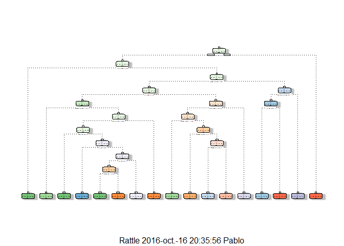

# Practical Machine Learning Project
Pendril Mandril  
16 de octubre de 2016  


## Background and Introduction

Using devices such as Jawbone Up, Nike FuelBand, and Fitbit is now possible to collect a large amount of data about personal activity relatively inexpensively. These type of devices are part of the quantified self movement – a group of enthusiasts who take measurements about themselves regularly to improve their health, to find patterns in their behavior, or because they are tech geeks. One thing that people regularly do is quantify how much of a particular activity they do, but they rarely quantify how well they do it.

In this project, we will be to use data from accelerometers on the belt, forearm, arm, and dumbell of 6 participant They were asked to perform barbell lifts correctly and incorrectly in 5 different ways. The five ways are exactly according to the specification (Class A), throwing the elbows to the front (Class B), lifting the dumbbell only halfway (Class C), lowering the dumbbell only halfway (Class D) and throwing the hips to the front (Class E). Only Class A corresponds to correct performance. The goal of this project is to predict the manner in which they did the exercise, i.e., Class A to E. More information is available from the website here: http://groupware.les.inf.puc-rio.br/har (see the section on the Weight Lifting Exercise Dataset).


## Data Processing
### Import the data

We first load the needed packages to do de analysis and load the data.


```r
library(dplyr)
library(caret)
library(rpart)
library(rattle)
library(randomForest)
```


```r
training <- read.csv("pml-training.csv", header = T)
testing <- read.csv("pml-testing.csv", header = T)
```

### Data cleaning

We get rid of variables with missing data and also the first seven variables which don't contain useful information.


```r
training <- dplyr::select(training, -c(1:7))
testing <- dplyr::select(testing, -c(1:7))
training <- training[,!apply(is.na(training), 2, any)]
testing <- testing[,!apply(is.na(testing), 2, any)]
```
Also, we we'll remove variables with near zero variance


```r
nzv <- nearZeroVar(training,saveMetrics=TRUE)
training <- training[,nzv$nzv==FALSE]

nzv<- nearZeroVar(testing,saveMetrics=TRUE)
testing <- testing[,nzv$nzv==FALSE]
```


### Data splitting
Now we'll split the data so we could train and and validate our in-sample results.

```r
set.seed(1111) 
inTrain <- createDataPartition(training$classe, p = 0.7, list = FALSE)
trainSet <- training[inTrain, ]
validationSet <- training[-inTrain, ]
```


## Creating the models
We will use cross validation to estimate an out of sample error and get the optimum parameters

```r
control <- trainControl(method = "repeatedcv", number = 4)
model.rp <- train(classe ~., trainSet, method = "rpart", na.action = na.omit,
                  trControl = control, tuneLength = 10)
print(model.rp)
```

```
## CART 
## 
## 13737 samples
##    52 predictor
##     5 classes: 'A', 'B', 'C', 'D', 'E' 
## 
## No pre-processing
## Resampling: Cross-Validated (4 fold, repeated 1 times) 
## Summary of sample sizes: 10302, 10303, 10303, 10303 
## Resampling results across tuning parameters:
## 
##   cp          Accuracy   Kappa     
##   0.01373207  0.7025553  0.62218072
##   0.01515614  0.6804990  0.59693978
##   0.01774997  0.6718357  0.58575566
##   0.02044553  0.6443176  0.55278544
##   0.02125928  0.6301963  0.53547293
##   0.02242905  0.5617630  0.43333016
##   0.03071915  0.5282096  0.38477717
##   0.03529651  0.4987978  0.34538835
##   0.05957346  0.4297928  0.23169228
##   0.11565456  0.3449792  0.09237433
## 
## Accuracy was used to select the optimal model using  the largest value.
## The final value used for the model was cp = 0.01373207.
```

<!-- -->
Now we'll predict outcomes using validation set and show the results

```r
pred.rp <- predict(model.rp, validationSet)
conf.rp <- confusionMatrix(validationSet$classe, pred.rp)
print(conf.rp)
```

```
## Confusion Matrix and Statistics
## 
##           Reference
## Prediction    A    B    C    D    E
##          A 1383   36   41  208    6
##          B  227  587   98  193   34
##          C   11  121  621  232   41
##          D   74   39   61  737   53
##          E   34   65   78  184  721
## 
## Overall Statistics
##                                          
##                Accuracy : 0.688          
##                  95% CI : (0.676, 0.6998)
##     No Information Rate : 0.2938         
##     P-Value [Acc > NIR] : < 2.2e-16      
##                                          
##                   Kappa : 0.6061         
##  Mcnemar's Test P-Value : < 2.2e-16      
## 
## Statistics by Class:
## 
##                      Class: A Class: B Class: C Class: D Class: E
## Sensitivity            0.7999  0.69222   0.6908   0.4743   0.8433
## Specificity            0.9300  0.89041   0.9188   0.9476   0.9282
## Pos Pred Value         0.8262  0.51536   0.6053   0.7645   0.6664
## Neg Pred Value         0.9178  0.94501   0.9428   0.8340   0.9721
## Prevalence             0.2938  0.14410   0.1528   0.2641   0.1453
## Detection Rate         0.2350  0.09975   0.1055   0.1252   0.1225
## Detection Prevalence   0.2845  0.19354   0.1743   0.1638   0.1839
## Balanced Accuracy      0.8649  0.79131   0.8048   0.7109   0.8858
```
The results give an accuracy similar as estimated with cross validation.

Looking at those results, let's try a different approach with KNN neighbors

```r
model.knn <- train(classe ~., trainSet, method = "knn", na.action = na.omit,
                   trControl = control, tuneLength = 5)
print(model.knn)
```

```
## k-Nearest Neighbors 
## 
## 13737 samples
##    52 predictor
##     5 classes: 'A', 'B', 'C', 'D', 'E' 
## 
## No pre-processing
## Resampling: Cross-Validated (4 fold, repeated 1 times) 
## Summary of sample sizes: 10304, 10302, 10302, 10303 
## Resampling results across tuning parameters:
## 
##   k   Accuracy   Kappa    
##    5  0.8761740  0.8432910
##    7  0.8533885  0.8144879
##    9  0.8348254  0.7909589
##   11  0.8216493  0.7742264
##   13  0.8084006  0.7574781
## 
## Accuracy was used to select the optimal model using  the largest value.
## The final value used for the model was k = 5.
```

```r
plot(model.knn)
```

<!-- -->

Again we'll predict outcomes using validation set and show the results

```r
pred.knn <- predict(model.knn, validationSet)
conf.knn <- confusionMatrix(validationSet$classe, pred.knn)
print(conf.knn)
```

```
## Confusion Matrix and Statistics
## 
##           Reference
## Prediction    A    B    C    D    E
##          A 1607   11   18   28   10
##          B   58  976   53   27   25
##          C   13   35  940   18   20
##          D   20    6   74  855    9
##          E   10   54   27   41  950
## 
## Overall Statistics
##                                           
##                Accuracy : 0.9054          
##                  95% CI : (0.8976, 0.9127)
##     No Information Rate : 0.2902          
##     P-Value [Acc > NIR] : < 2.2e-16       
##                                           
##                   Kappa : 0.8802          
##  Mcnemar's Test P-Value : < 2.2e-16       
## 
## Statistics by Class:
## 
##                      Class: A Class: B Class: C Class: D Class: E
## Sensitivity            0.9409   0.9020   0.8453   0.8824   0.9369
## Specificity            0.9840   0.9661   0.9820   0.9778   0.9729
## Pos Pred Value         0.9600   0.8569   0.9162   0.8869   0.8780
## Neg Pred Value         0.9760   0.9777   0.9646   0.9768   0.9867
## Prevalence             0.2902   0.1839   0.1890   0.1647   0.1723
## Detection Rate         0.2731   0.1658   0.1597   0.1453   0.1614
## Detection Prevalence   0.2845   0.1935   0.1743   0.1638   0.1839
## Balanced Accuracy      0.9624   0.9340   0.9137   0.9301   0.9549
```
That's a better accuracy.

Finally we'll do the same with random forest


```r
model.rf <- train(classe ~., trainSet, method = "rf", na.action = na.omit,
                   trControl = control, tuneLength = 3)
print(model.rf)
```

```
## Random Forest 
## 
## 13737 samples
##    52 predictor
##     5 classes: 'A', 'B', 'C', 'D', 'E' 
## 
## No pre-processing
## Resampling: Cross-Validated (4 fold, repeated 1 times) 
## Summary of sample sizes: 10304, 10301, 10303, 10303 
## Resampling results across tuning parameters:
## 
##   mtry  Accuracy   Kappa    
##    2    0.9900271  0.9873838
##   27    0.9899539  0.9872911
##   52    0.9856589  0.9818572
## 
## Accuracy was used to select the optimal model using  the largest value.
## The final value used for the model was mtry = 2.
```
<!-- -->

Now again we'll predict outcomes using validation set and show the results

```r
pred.rf <- predict(model.rf, validationSet)
conf.rf <- confusionMatrix(validationSet$classe, pred.rf)
print(conf.rf)
```

```
## Confusion Matrix and Statistics
## 
##           Reference
## Prediction    A    B    C    D    E
##          A 1673    1    0    0    0
##          B    4 1131    4    0    0
##          C    0    7 1018    1    0
##          D    0    0   20  944    0
##          E    0    0    0    2 1080
## 
## Overall Statistics
##                                          
##                Accuracy : 0.9934         
##                  95% CI : (0.991, 0.9953)
##     No Information Rate : 0.285          
##     P-Value [Acc > NIR] : < 2.2e-16      
##                                          
##                   Kappa : 0.9916         
##  Mcnemar's Test P-Value : NA             
## 
## Statistics by Class:
## 
##                      Class: A Class: B Class: C Class: D Class: E
## Sensitivity            0.9976   0.9930   0.9770   0.9968   1.0000
## Specificity            0.9998   0.9983   0.9983   0.9959   0.9996
## Pos Pred Value         0.9994   0.9930   0.9922   0.9793   0.9982
## Neg Pred Value         0.9991   0.9983   0.9951   0.9994   1.0000
## Prevalence             0.2850   0.1935   0.1771   0.1609   0.1835
## Detection Rate         0.2843   0.1922   0.1730   0.1604   0.1835
## Detection Prevalence   0.2845   0.1935   0.1743   0.1638   0.1839
## Balanced Accuracy      0.9987   0.9956   0.9877   0.9964   0.9998
```
Which leads to really high accuracy. 
Thus, random forest is the optimum algorithm between the three studied here.

Then, we will apply random forest to the test set to predict the 20 observations

```r
pred.test <- predict(model.rf, testing[,1:52])
print(pred.test)
```

```
##  [1] B A B A A E D B A A B C B A E E A B B B
## Levels: A B C D E
```


